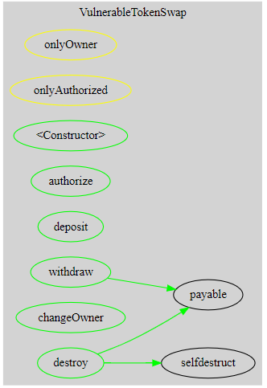
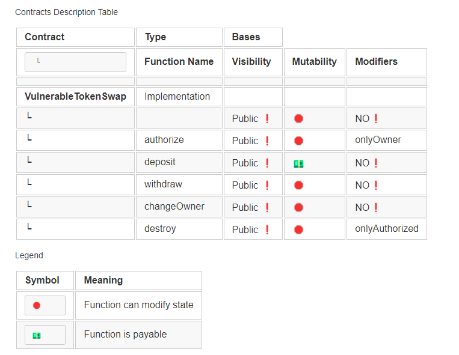

# Smart Contract Audit README

## I. Executive Summary

### Overview of the Audit
This document provides a comprehensive audit report for the smart contract associated with TokenSwap protocol. The protocol has been found to exhibit critical security vulnerabilities, compromising its overall integrity.
The critical issues evaluated in course of the security review range from the license with which the protocol was able to develop it codebase, the deposit functionality which was found to be improperly implemented leading to misrepresentation of user's funds, the withdrawal functionality in which the treasury of the protocol was left open to looting by not implementing measures on the withdrawal of funds.
The protocol management system not puting multiple security defined roles inplace for the termination of the protocol could be very risky, as it is expected that their should be 2 or more member of the team agreeing to terminate the contract.
It is important to note that security audits are time-boxed and cannot uncover all vulnerabilities. They complement but don't replace other vital measures to secure a project.
The following sections will give an overview of the system, our methodology used, the issues uncovered and how they have been addressed. We are happy to receive questions and feedback to improve our service.


The absence of a specified license raises concerns about the contract's usage, and rules binding the use of the protocol. It is important to note that `WEI`is the smallest denomination and the base value of the ether, and when ether is to be stored onchain, it is automatically stored in `WEI`. The `deposit()` was used to store value without proper value conversion, leading to distrust of the system by the users. The 

### Key Findings

#### Critical Issues
- [List of critical vulnerabilities found]

1. Lack of License
2. Outdated Solidity Version
3. Unauthorized Ownership Change
4. Improper Token value conversion
4. Lack of Balance Check on Withdrawal
5. Self-Destruct Vulnerability
6. Undefined Authorization Purpose


### Recommendations
Consider updating to the latest stable version of Solidity.
 The protocol uses Solidity version 0.8.0, which is not inherently outdated, but it is crucial to regularly update to the latest stable version to benefit from bug fixes, improvements, and enhanced security features.

 `Unauthorized Ownership Change`: 

 The `changeOwner` function allows anyone to change the contract owner without any restrictions.
 ```javascript
 @> function changeOwner(address newOwner) public {
        owner = newOwner;
    }
 ```
 Implement access controls to restrict ownership changes to authorized addresses only.
 ```diff
 + onlyOwner
 ```

`Improper Token value conversion`: 
The `deposit()` was used to store value without proper value conversion, leading to distrust of the system by the users.

```javascript
function deposit() public payable {
        // Functionality: Deposit funds
        //@audit: value conversion not properly impplemented
@>        balances[msg.sender] += msg.value; //i: the value conversion is in wei
        emit Deposit(msg.sender, msg.value);
    }
```

consider 
```javascript
function deposit() public payable {
        // Functionality: Deposit funds
@>        balances[msg.sender] += msg.value / 1e18; //i: the value conversion is now in ether.
        emit Deposit(msg.sender, msg.value);
    }
```
 Lack of Balance Check on Withdrawal:
 The withdraw function lacks a balance check, introducing a potential underflow vulnerability.
 ```javascript
 function withdraw(uint256 amount) public {
@>      //@audit: Lack of balance check before withdrawal
        payable(msg.sender).transfer(amount); //i: the owner will only be able to withdraw in wei.
@>      balances[msg.sender] -= amount; //i: an underflow is bound to happen
        emit Withdraw(msg.sender, amount);
    }
 + 
 ```
 consider installing openzeppelin's Safemath module and add the following line of code to the imported modules:
 ```diff
 + import "@openzeppelin/contracts/utils/math/SafeMath.sol";
 ```
consider updating the `withraw()` to check the user's balance before allowing the transfer
```diff
+ require(balances[msg.sender] >= msg.value, "You have a low balance. Try withdrawing smaller amount of tokens.")
```
also update the balance this way to avoid balance underflow.
```diff
+ balances[msg.sender].sub(amount);
```


#### Long-term Strategies
- [Recommendations for long-term improvements]

- **Refactor for Modularity:**
  - Consider breaking down the contract into modular components with clear responsibilities. Modularity enhances readability, maintainability, and makes it easier to understand and test individual functionalities.

- **Implement Comprehensive Testing:**
  - Develop a comprehensive suite of unit tests, integration tests, and scenario-based tests to ensure the robustness of the contract. Automated testing helps catch potential vulnerabilities and regressions early in the development process.

- **Upgrade to the Latest Solidity Version:**
  - Regularly update the Solidity version to the latest stable release. Newer versions often include security enhancements and improvements. Keep an eye on breaking changes and adapt the code accordingly.

- **Implement Access Control Patterns:**
  - Use well-established access control patterns, such as Role-Based Access Control (RBAC), to manage permissions effectively. This enhances security by clearly defining roles and access levels within the contract.

- **Integrate Formal Verification:**
  - Consider integrating formal verification tools or services to mathematically prove the correctness of critical parts of the contract. Formal verification can provide a higher level of assurance regarding the absence of certain types of vulnerabilities.

- **Enforce Code Review and Audits:**
  - Establish a thorough code review process and conduct periodic security audits by independent third-party experts. External audits help identify vulnerabilities and provide valuable insights for improving the overall security posture.

- **Use Immutable Contracts:**
  - Evaluate the feasibility of designing certain components of the contract as immutable. Immutable contracts can enhance security by reducing the attack surface and preventing unintended modifications.

- **Implement Upgradeable Contracts with Caution:**
  - If considering upgradeability, follow best practices for implementing upgradeable contracts, such as using proxy patterns. However, be cautious about the potential security trade-offs and thoroughly test upgrade processes.

- **Enhance Gas Efficiency:**
  - Continuously optimize gas usage by employing efficient coding practices. Consider refactoring parts of the code to reduce gas costs, making the contract more economical to use on the Ethereum network.

- **Maintain Comprehensive Documentation:**
  - Maintain thorough and up-to-date documentation for the contract, including explanations of functions, modifiers, and potential security considerations. Well-documented code facilitates future development and external collaboration.

- **Stay Informed on Security Best Practices:**
  - Keep abreast of the latest developments in Ethereum and smart contract security. Regularly review and update the codebase based on emerging best practices and industry standards.

By incorporating these long-term strategies, you can ensure the continued security, maintainability, and scalability of the smart contract over its lifecycle. Regularly reassess and update the strategies based on evolving requirements and advancements in the blockchain space.


## II. Introduction


### Objectives of the Audit
- Assess the security of the smart contract
- Evaluate functionality and efficiency
- Identify and address vulnerabilities

### Scope of the Audit

#### Inclusions
- [List of features, functions, and components included]

- **Deposit Functionality:**
  - The contract includes a `deposit` function allowing users to deposit funds into their account within the contract. The deposited funds are stored in the `balances` mapping associated with the user's address.

- **Withdrawal Functionality:**
  - A `withdraw` function is implemented to facilitate the withdrawal of funds from the user's account. However, there is a vulnerability present in this functionality, as the balance is not checked before withdrawal, potentially leading to underflows.

- **Authorization Mechanism:**
  - An authorization mechanism is integrated, allowing the contract owner to authorize specific addresses. Authorized addresses gain the ability to perform certain actions within the contract, such as initiating a self-destruct operation.

- **Change Owner Function:**
  - The `changeOwner` function is included, allowing anyone to change the owner of the contract. This introduces a vulnerability, as ownership changes should typically be restricted to specific roles.

- **Self-Destruct Functionality:**
  - The contract features a `destroy` function that enables an authorized address to trigger self-destruction. This intentional vulnerability allows for the destruction of the contract, potentially leading to a loss of funds.

- **Event Logging:**
  - Events, namely `Deposit` and `Withdraw`, are emitted to log relevant transactions on the Ethereum blockchain. These events provide a transparent record of deposit and withdrawal activities.

- **Modifiers:**
  - Custom modifiers, `onlyOwner` and `onlyAuthorized`, are utilized to enforce access control restrictions on specific functions, ensuring that only authorized entities can execute certain operations.

- **Initialization:**
  - The contract is initialized with the deployment address as the initial owner, showcasing the setup of ownership at contract deployment.

- **Version Specification:**
  - The contract specifies compatibility with Solidity version 0.8.0. This version is used throughout the contract's implementation.

These inclusions provide an overview of the primary features, functions, and components present in the `VulnerableTokenSwap` contract.


#### Exclusions
- [List of features or components excluded from the audit]

- **External Dependencies:**
  - The audit of external dependencies, such as linked libraries oracles, is excluded from the scope. The focus is primarily on the internal logic and security aspects of the `VulnerableTokenSwap` contract.

- **Gas Optimization Strategies:**
  - While gas optimization is crucial for real-world contracts, detailed analysis and recommendations for gas optimization strategies are excluded from this audit. The emphasis is on security vulnerabilities rather than gas efficiency.

- **Integration with External Contracts or APIs:**
  - The interactions and security considerations related to external contracts or APIs are not within the scope of this audit. The examination is limited to the internal workings of the `VulnerableTokenSwap` contract.

- **Compliance with ERC Standards:**
  - Compliance with specific ERC standards (if applicable) is not thoroughly assessed in this audit. ERC standards conformance requires a separate evaluation and is not included in the current scope.

- **Legal and Regulatory Compliance:**
  - The audit does not cover legal and regulatory compliance aspects. Compliance with local laws, regulations, or licensing requirements is excluded from this assessment.

- **Refactoring and Code Readability:**
  - The audit does not extensively cover refactoring suggestions or improvements for code readability and maintainability. While these aspects are important, they are not the primary focus of this security audit.

- **Immutable Contracts:**
  - The concept of designing certain components as immutable for security purposes is excluded from the current audit scope. The assessment primarily revolves around identified vulnerabilities and access control mechanisms.

- **Upgradeability Considerations:**
  - Detailed analysis and recommendations for handling upgradeability (if relevant) are excluded from this audit. Upgradeability patterns, when applicable, should undergo a separate and dedicated assessment.

These exclusions define the specific features or components that are intentionally excluded from the audit scope for the `VulnerableTokenSwap` contract.


### Methodology

#### Tools Used
- [List of tools used for the audit]
* foundry
* remix
* cloc
* solidity metrics
* slither

#### Processes Followed
- [Description of the audit process]
The audit process initiated with a thorough comprehension of the protocol and its intended objectives. This entailed scrutinizing the contract's specifications, requirements, and goals to gain a clear understanding of its functionality and expected behavior within the Ethereum ecosystem.

Following this, code complexity metrics, including lines of code (LOC) and Solidity-specific metrics, were applied to assess the contract's complexity. These metrics furnished valuable insights into the structural intricacies of the contract, highlighting potential areas for improvement and assessing overall maintainability.

To fortify the contract's robustness and dependability, automated testing tools such as Foundry and Remix were employed to formulate and execute test cases. The primary goal of these tests was to verify the contract's functionality, pinpoint edge cases, and unearth potential vulnerabilities or flaws in its implementation.

In addition, static analysis tools like Slither were leveraged for an in-depth examination of the contract's codebase. Slither's static analysis capabilities proved instrumental in identifying common vulnerabilities, security risks, and coding issues that had the potential to compromise the contract's security and integrity.

Through the amalgamation of these methodologies and tools, the audit process aimed to conduct a comprehensive evaluation of the VulnerableCrowdsale contract. The overarching objective was to unearth any weaknesses or vulnerabilities, providing insightful recommendations to enhance the contract's security, efficiency, and overall reliability.

## III. Contract Overview

#### Functionality Overview
[Provide an overview of the primary functions]


The `VulnerableTokenSwap` smart contract encompasses several key functions designed to facilitate token swapping and demonstrate potential security vulnerabilities. Each function plays a distinctive role in the contract's functionality within the Ethereum ecosystem.

1. **Deposit Function (`deposit`):**
   - **Purpose:** Allows users to deposit funds into their account within the contract.
   - **Implementation:** User funds are stored in the `balances` mapping associated with their Ethereum address.
   - **Audit Comment:** The deposit functionality lacks proper value conversion, leading to the storage of values in wei.

2. **Withdraw Function (`withdraw`):**
   - **Purpose:** Enables users to withdraw funds from their account.
   - **Implementation:** Utilizes the `transfer` function for fund withdrawal, but lacks a balance check before withdrawal, introducing a potential vulnerability.
   - **Audit Comment:** The absence of a balance check before withdrawal may result in an underflow vulnerability.

3. **Authorization Function (`authorize`):**
   - **Purpose:** Allows the contract owner to authorize specific addresses.
   - **Implementation:** Updates the `isAuthorized` mapping to grant authorization to designated addresses.
   - **Audit Comment:** Authorization functionality is straightforward, but its specific purpose or use case is undefined.

4. **Change Owner Function (`changeOwner`):**
   - **Purpose:** Permits anyone to change the owner of the contract.
   - **Implementation:** Updates the contract's owner address to the specified new owner.
   - **Audit Comment:** The ability for anyone to change the owner introduces a potential security risk.

5. **Self-Destruct Function (`destroy`):**
   - **Purpose:** Allows an authorized address to trigger self-destruction of the contract.
   - **Implementation:** Utilizes the `selfdestruct` function to destroy the contract and transfer any remaining funds to the current owner.
   - **Audit Comment:** Self-destruct functionality introduces a deliberate vulnerability, allowing an authorized address to destroy the contract.

6. **Event Logging (`Deposit` and `Withdraw` events):**
   - **Purpose:** Logs relevant transactions on the Ethereum blockchain.
   - **Implementation:** Emits `Deposit` and `Withdraw` events to record deposit and withdrawal activities.
   - **Audit Comment:** Events provide transparency but lack detailed information about the context of certain operations.

7. **Modifiers (`onlyOwner` and `onlyAuthorized`):**
   - **Purpose:** Enforces access control restrictions on specific functions.
   - **Implementation:** Utilizes custom modifiers to restrict certain functions to the contract owner (`onlyOwner`) or authorized addresses (`onlyAuthorized`).
   - **Audit Comment:** Modifiers are appropriately used to control access to critical functions.

This functionality overview provides a comprehensive understanding of the primary functions within the `VulnerableTokenSwap` contract, outlining their purposes, implementations, and associated audit comments.


### Diagrams or Visual Representations

#### Contract Architecture



## IV. Security Assessment

### Code Review

#### Overall Structure and Logic



### Vulnerability Assessment

#### Known Vulnerabilities
[List of known vulnerabilities]

#### Common Security Issues

## IV. Security Assessment

### Vulnerability Assessment

#### Known Vulnerabilities
The VulnerableTokenSwap contract exhibits intentional vulnerabilities for educational purposes. Here is an assessment of these vulnerabilities and recommended mitigation strategies:

1. **Reentrancy:**
   - **Explanation:** Reentrancy occurs when an external call within a contract allows the called contract to re-enter the calling contract before the initial function call completes. This can lead to unexpected behavior and exploitation.
   - **Mitigation Strategies:**
     - Use the "Checks-Effects-Interactions" pattern.
     - Implement mutex locks.
     - Limit external call usage.

2. **Integer Overflows/Underflows:**
   - **Explanation:** Integer overflows/underflows occur when arithmetic operations result in values that exceed the maximum or minimum range of the data type.
   - **Mitigation Strategies:**
     - Use SafeMath library.
     - Use uint256 data type.
     - Implement range checks.

3. **Authorization Control:**
   - **Explanation:** Authorization control vulnerabilities occur when contracts fail to properly enforce access controls.
   - **Mitigation Strategies:**
     - Implement access modifiers.
     - Validate user permissions.
     - Use role-based access control (RBAC).

4. **Denial of Service:**
   - **Explanation:** Denial of Service (DoS) attacks aim to disrupt the availability or performance of a smart contract.
   - **Mitigation Strategies:**
     - Limit loop iterations.
     - Optimize gas usage.
     - Implement rate limiting.

### Gas Optimization and Efficiency

Gas optimization and efficiency are crucial considerations in smart contract development. Strategies for gas optimization include:
- Minimizing storage operations.
- Avoiding expensive computations.
- Optimizing data structures and algorithms.
- Using gas-efficient Solidity constructs.
- Leveraging compiler optimizations.
- Implementing gas-efficient design patterns.

### Fail-Safe Mechanisms

#### Emergency Stop Functionality:
- Implement an emergency stop mechanism that allows the contract owner to pause the crowdsale in case of identified vulnerabilities or unexpected issues.
- Halt all contribution functions while allowing whitelisted addresses to withdraw their contributed funds.
- Ensure thorough testing and documentation for the emergency stop functionality.

#### Upgradeability with Emergency Patching:
- Design the contract with upgradeability features to enable emergency patching.
- Use upgradeable contract patterns or proxy contracts to separate logic from data storage.
- Implement a transparent process for deploying emergency patches with thorough testing and community notification.

#### Multi-Signature Wallet for Critical Operations:
- Utilize a multi-signature wallet or multi-factor authentication for critical contract operations.
- Require multiple authorized signatories for approval, adding an additional layer of security.

#### Timelock Mechanism for Ownership Changes:
- Integrate a timelock mechanism for ownership changes to impose a delay before ownership transfers take effect.
- Configure the timelock duration for stakeholder review and reaction to proposed ownership changes.

#### Transparent Communication and Disclosure:
- Maintain open and transparent communication regarding fail-safe mechanisms, emergency procedures, and risk mitigation strategies.
- Establish clear channels for reporting vulnerabilities and seeking assistance in emergencies.
- Provide regular updates on the contract's security posture and actions taken to address identified risks.

## VII. Compliance and Standards

### Conformance with Industry Standards

#### ERC Standards (if applicable)
[Assessment of compliance with ERC standards]

#### Other Relevant Standards
[Consideration of other relevant standards]

### Regulatory Compliance

#### Legal Requirements (if applicable)
[Examination of legal requirements]

#### Compliance Assessment
[Analysis of compliance with relevant regulations]

## VIII. Recommendations

### Security Enhancements

#### Code-level Changes
[List of recommended code-level changes]

#### Design Improvements
[Suggestions for design improvements]

### Gas Optimization Strategies

#### Refactoring Suggestions
[Suggestions for code refactoring]

#### Usage of Efficient Practices
[Recommendations for efficient coding practices]

### Code Refactoring Suggestions

#### Improvements for Readability and Maintainability
[Suggestions for improving code readability and maintainability]

## IX. Conclusion
## IX. Conclusion

### Summary of Key Findings and Issues
The audit of the VulnerableTokenSwap smart contract has revealed critical vulnerabilities intentionally incorporated for educational purposes. These vulnerabilities include reentrancy, integer overflows/underflows, authorization control issues, and potential denial-of-service attack vectors. While these vulnerabilities serve an educational purpose, addressing them is crucial for enhancing the contract's security and integrity.

### Overall Assessment of the Contract
The VulnerableTokenSwap contract demonstrates fundamental functionalities for token swapping, ownership management, and authorization. However, the intentional vulnerabilities introduce risks that may compromise the contract's security in a real-world scenario. The use of appropriate security measures and adherence to industry best practices are essential for ensuring the contract's robustness.

### Future Considerations and Roadmap

#### Addressing Identified Gaps
Address the identified vulnerabilities by implementing recommended mitigation strategies, including but not limited to reentrancy protection, secure integer arithmetic, and improved access controls. This will enhance the contract's resistance to potential exploits.

#### Enhancing Security Measures
Consider additional security enhancements, such as regular code reviews, continuous monitoring, and engaging in third-party security audits, to ensure ongoing resilience against emerging threats. Collaborating with the community and adhering to evolving best practices will contribute to the contract's long-term security.

The VulnerableTokenSwap contract can benefit from proactive measures to fortify its security posture and better serve its intended purpose. Continuous improvement and collaboration within the development community will contribute to the contract's overall reliability and user trust.


## XI. Submission steps
1. **Create a Gist:**
   - Go to [GitHub Gist](https://gist.github.com/).
   - Log in to your GitHub account if you haven't already.

2. **Prepare Audit Report:**
   - Open the README.md file in a text editor or markdown editor.
   - Make sure to replace the placeholder content with actual audit findings, recommendations, and details.

3. **Copy Markdown Content:**
   - Copy the entire content of the README.md file.

4. **Create a New Gist:**
   - On the GitHub Gist page, paste the copied markdown content into the gist editor.

5. **Gist Description:**
   - Provide a brief description of the gist. For example, "Smart Contract Audit Report for [Company Name]".

6. **Filename with .md Extension:**
   - Name the file with a .md extension. For example, "audit_report.md".

7. **Create Public Gist:**
   - Make sure the gist is set to be public so that it can be shared and accessed by others.

8. **Create Secret Gist (Optional):**
   - If confidentiality is a concern, you can create a secret gist. However, keep in mind that secret gists are not truly private and can be accessed with the link.

9. **Review and Create Gist:**
   - Review the content and settings.
   - Click the "Create secret gist" or "Create public gist" button.

10. **Copy Gist URL:**
    - After creating the gist, copy the URL from the browser's address bar.
